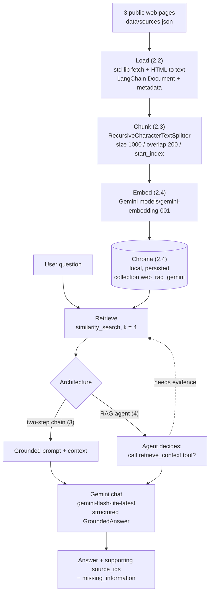

# Building a RAG Application with Gemini

Homework for the workshop *RAG, LLM architecture and agentic patterns*. It adapts the
workshop's professional RAG stack (`03_real_llm_rag_agentic_patterns.ipynb`) to a new,
self-chosen document collection and adds an evaluation.

**Author:** Daniel Patiño Mejia

---

## 1. Objective and use case

Build a small Retrieval-Augmented Generation application that answers questions **only** from a
fixed set of public web pages, cites the source it used, and says what is missing when the
pages do not contain the answer. The notebook covers the full pipeline &mdash; load, chunk,
embed, store, retrieve, generate &mdash; and implements the two architectures compared in the
workshop:

- a **two-step RAG chain** (`retrieve` &rarr; `generate`), and
- a **RAG agent** that decides for itself whether to retrieve before answering.

The chosen corpus mixes three deliberately different domains so retrieval has to discriminate
between clearly separate topics: a university degree programme (in Spanish), a Linux
distribution, and a cloud provider.

## 2. Document collection

The collection is declared in [`data/sources.json`](data/sources.json) and loaded by the
notebook in section 2.2. All three are public, read-only web pages; nothing requires a login.
Retrieved on **2026-08-31**.

| `source_id` | Page | URL | Why it was selected |
| --- | --- | --- | --- |
| `ECIJG` | Ingeniería de Sistemas &mdash; Escuela Colombiana de Ingeniería Julio Garavito | <https://www.escuelaing.edu.co/es/programas/ingenieria-de-sistemas/> | Home institution of the course; the authoritative description of the Systems Engineering programme. Spanish-language, so it also tests retrieval on a non-English page. |
| `CACHYOS` | CachyOS &mdash; Blazingly Fast OS based on Arch Linux | <https://cachyos.org/> | A short, claim-dense product landing page from a personal-interest technical domain; a size and style contrast with the other two. |
| `AWS` | Global Infrastructure &mdash; AWS | <https://aws.amazon.com/about-aws/global-infrastructure/> | A well-scoped page on one technical topic with concrete figures, good for checking that answers stay grounded in specific numbers. |

Each source keeps the metadata `source` (URL), `title`, `source_id`, `expected_question` and
`kind`, inherited by every chunk. `data/sources.json` also records `fallback_url` (the bare
domain), `why_selected`, a licence note and the retrieval date.

**Questions the application is expected to answer** (one per source, used to test retrieval in
2.5 and the chain in 3.3):

- `ECIJG` &mdash; *What emphasis does the Systems Engineering program offer?*
- `CACHYOS` &mdash; *Why is CachyOS different from other Linux distributions?*
- `AWS` &mdash; *What is the global infrastructure of AWS?*

## 3. Architecture



## 4. Installation and execution

Requires Python 3.12+ (developed and delivered on 3.14) and a Gemini Developer API key
(free tier is enough).

```bash
# 1. clone and enter the repo
git clone https://github.com/daniel-pm19/building-a-rag-application-with-gemini.git
cd building-a-rag-application-with-gemini

# 2. create an isolated environment and install
python -m venv .venv
source .venv/bin/activate            # Windows: .venv\Scripts\activate
pip install -r requirements.txt

# 3. add your API key
cp .env.example .env
#   then edit .env and set GOOGLE_API_KEY=...

# 4. run the notebook top to bottom
jupyter lab notebooks/rag_application.ipynb
```

The notebook resolves the repo root itself, so it also runs from the repo root
(`jupyter nbconvert --to notebook --execute --inplace notebooks/rag_application.ipynb`).

Run the cells in order. Section 2.4 downloads the three pages and builds a local Chroma
database in `chroma_web_rag_db/` (git-ignored, rebuilt on every run because `REBUILD_INDEX =
True`). Without a key, the notebook still runs: the cells that need Gemini detect the missing
key and skip, printing a note instead of failing.

Total cost of one full run is roughly 40 embedding + generation calls, well inside the free
tier.

## 5. Environment variables

Stored in a local `.env` (git-ignored); `.env.example` lists the names with no secrets.

| Variable | Required | Default | Purpose |
| --- | --- | --- | --- |
| `GOOGLE_API_KEY` | yes | &mdash; | Gemini Developer API key. `GEMINI_API_KEY` is also accepted. If neither is set the notebook asks for it with `getpass`. |
| `GEMINI_EMBEDDING_MODEL` | no | `models/gemini-embedding-001` | Embedding model id. |
| `GEMINI_CHAT_MODEL` | no | `google_genai:gemini-flash-lite-latest` | Chat model id, with the `google_genai:` provider prefix consumed by `init_chat_model`. |

## 6. Gemini models used

| Role | Identifier | How it is created |
| --- | --- | --- |
| Chat / generation | `google_genai:gemini-flash-lite-latest` | `init_chat_model(GEMINI_CHAT_MODEL, temperature=0)` |
| Embeddings | `models/gemini-embedding-001` | `GoogleGenerativeAIEmbeddings(model=GEMINI_EMBEDDING_MODEL)` |

`gemini-flash-lite-latest` is a **rolling alias** that always points at the current Gemini
Flash-Lite build. It is used instead of a dated id because the dated `gemini-2.5-flash-lite`
now returns `404 NOT_FOUND` ("no longer available to new users") for newly issued API keys. On
**2026-08-31** the alias resolved to the Gemini 3.5 Flash-Lite family. To freeze an exact
model, set `GEMINI_CHAT_MODEL` in `.env` to a specific dated id (for example
`google_genai:gemini-3.5-flash-lite`).

## 7. Principal design decisions

- **Chunking: `chunk_size = 1000`, `chunk_overlap = 200` (20 %), `add_start_index = True`.**
  1000 characters holds one self-contained idea while keeping each embedding vector focused;
  200 characters of overlap keeps an idea that lands on a boundary whole in at least one
  chunk. `start_index` lets every retrieved chunk be traced back to its offset in the page.
  Full rationale in notebook section 2.6.
- **`top_k = 4`.** The corpus is three short pages, so a small `k` gives a few genuinely
  relevant passages plus slack for embedding imprecision; ~4 x 1000 characters of context
  stays cheap for Flash-Lite. Larger `k` mostly adds off-topic text.
- **`MAX_CHUNKS_TO_INDEX = 40`, selected round-robin per source** (`balanced_chunk_sample`),
  so one long page (ECIJG produces ~29 of 71 chunks) cannot dominate the index and the run
  stays under free-tier embedding limits.
- **Structured output for grounding.** The chain's generator is forced through a Pydantic
  `GroundedAnswer` (`answer`, `sources_used`, `missing_information`). This makes "use only the
  retrieved evidence / say what is missing" a machine-checkable contract, and the reported
  `sources_used` are intersected with what was actually retrieved so the chain can never cite
  a source that was not in the evidence.
- **Two-step chain as a LangGraph `StateGraph`** (`retrieve` &rarr; `generate`) rather than the
  workshop's imperative function, so the state passed between steps is explicit.
- **Agent with `langchain.agents.create_agent`** (the current factory; `create_react_agent` is
  deprecated) and a `retrieve_context` tool declared `response_format="content_and_artifact"`,
  so the model reads a citable text block while the code keeps the raw `Document`s.
- **Prompt-injection basics.** Retrieved text is wrapped in `<context>` delimiters and both
  prompts tell the model to treat it as data, never as instructions.

## 8. Evaluation results

Three questions, one per retrieval outcome (notebook section 5). "Grounded?" is derived from
the structured output: `Yes` (sources, no gap), `Partial` (sources plus a declared gap),
`N/A (declined)` (no sources, gap declared).

| Question | Retrieved source | Result | Grounded? | Observation |
| --- | --- | --- | --- | --- |
| How many Availability Zones and Regions does the AWS Cloud span? | `AWS` | "The AWS Cloud spans 124 Availability Zones within 39 Geographic Regions." | **Yes** | Top-4 chunks are all from AWS; the answer repeats the page's exact figures. |
| How many semesters is the Systems Engineering program, and how many credits does it require to graduate? | `ECIJG` | "The Systems Engineering program has a duration of 8 semesters." + `missing_information`: no credit total on the page. | **Partial** | Retrieves the duration; the page lists credits per course but no total, which the answer flags as missing. |
| What was Amazon Web Services' annual revenue in its latest fiscal year? | `AWS` | "The context does not provide information about Amazon Web Services' annual revenue..." + `missing_information`. | **N/A (declined)** | Nearest chunks are AWS infrastructure text with no financial figure; the model declines instead of guessing. |

A second-opinion `GroundednessVerdict` judge (5.3) marks all three answers `grounded=True`,
including Q3, where a correct "not in the documents" makes no unsupported claim. Q2 is the
borderline case &mdash; grounded but only half-complete &mdash; and the judge's verdict there
can flip between runs.

**One case where retrieval worked well.** Q1: a factual "how many X and Y" question embeds
close to the single sentence that enumerates the figures, all four retrieved chunks are from
`AWS`, and the answer only has to copy the numbers.

**One failure / limitation.** Q2 shows that *grounded* (no unsupported claim) and *complete*
(answers the whole question) are different properties, and that "is the evidence sufficient?"
is the model's own, not always strict, judgement &mdash; asked about programme *cost* instead
of credits, the model accepts the qualitative "depends on family income" as a complete answer
and flags no gap. Retrieval precision on the long, list-like `ECIJG` page is also weak:
several retrieved chunks are accreditation or navigation text rather than the sentence a
reader would cite.

**One possible improvement.** Add hybrid (keyword + vector) retrieval so exact terms such as
*créditos* or *revenue* are matched even on a lukewarm embedding, add a source that carries
the currently-missing facts (the Escuela's full curriculum / costs page), and, for questions
that name their domain, filter retrieval by `source_id` and raise `MAX_CHUNKS_TO_INDEX`.

## 9. RAG chain vs RAG agent

Both were run on the same question, *"What is the global infrastructure of AWS?"* (notebook
section 4.3):

| | Two-step chain (3) | RAG agent (4) |
| --- | --- | --- |
| Retrieved? | Yes, always (once) | Yes &mdash; one `retrieve_context` call, query `"AWS global infrastructure"` |
| Sources used | `['AWS']` | `['AWS']` (same `similarity_search(k=4)` underneath) |
| Grounded? | Yes, and machine-checkable via `GroundedAnswer` | Yes; citations numbered by chunk in the prose |
| Model calls | 1 | 2 (decide &rarr; tool &rarr; answer) |
| On "multiply 12 by 8" | would still run a similarity search first | answers directly, **no** tool call |

**Did both retrieve?** Yes for the corpus question; only the chain would retrieve for the
arithmetic prompt. **Same sources?** Yes. **Similarly grounded?** Yes. **Which is simpler and
more appropriate here?** The **two-step chain**: the corpus is three pages and every genuine
question needs retrieval, so the agent's extra model call and non-deterministic control flow
buy nothing. The agent is the better choice when the workload mixes retrieval and
non-retrieval questions, when one question needs several searches, or when more tools are
added.

## 10. Limitations and possible improvements

| Limitation | Improvement |
| --- | --- |
| Standard-library loader only sees server-rendered HTML; JavaScript-heavy pages give thin text (why `ECIJG`/`AWS` use content URLs, not bare domains). | Use a headless-browser loader for JS pages. |
| Tiny corpus (3 pages, 40 indexed chunks); the round-robin cap trims ECIJG. | Raise `MAX_CHUNKS_TO_INDEX`, add more sources. |
| Distance-only dense retrieval; exact terms in another language are easy to miss. | Hybrid keyword + vector retrieval; a query-rewrite step. |
| Long ECIJG page pollutes results with navigation / boilerplate chunks. | Per-`source_id` metadata filter; better HTML cleaning. |
| Single-turn agent, no memory. | Add a checkpointer for follow-up questions. |
| The groundedness judge is itself an LLM and can disagree with the rule-based label (Q2). | Keep both signals; add a small human-labelled evaluation set. |
| Chat model is a rolling alias, not a frozen id. | Pin a dated `gemini-*-flash-lite` id once one is stable for the key. |

## Repository layout

```
building-a-rag-application-with-gemini/
├── notebooks/
│   └── rag_application.ipynb  # notebook, sections 1-5, delivered with outputs
├── data/
│   └── sources.json           # the document collection (loaded by section 2.2)
├── requirements.txt           # pinned to the tested versions
├── README.md
├── .env.example               # variable names, no secrets
├── .gitignore                 # ignores .env and chroma_web_rag_db/
└── chroma_web_rag_db/         # local vector store - git-ignored, rebuilt by section 2.4
```
